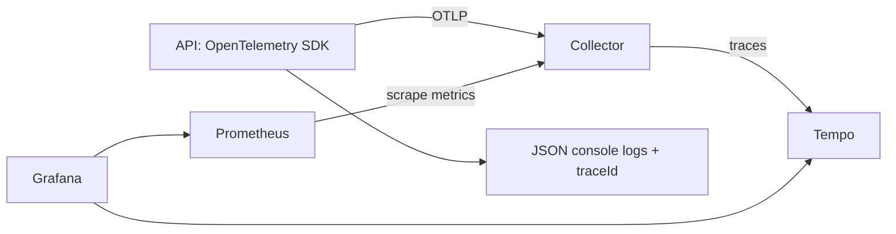

# Monitoring

## Data flow



The API instruments HTTP requests, HttpClient calls, Npgsql queries and .NET runtime metrics. Export is asynchronous. Collector availability does not determine API readiness.

- Metrics describe request rate, errors, latency distributions, runtime and database connections.
- Traces show HTTP requests and their database/outgoing HTTP spans.
- JSON logs remain in Docker stdout in this step; Loki collection is a separate step.
- `X-Trace-Id` links a response to its log scope and, when sampled, its Tempo trace. Automatic metric-to-trace exemplar links are a follow-up feature requiring exemplar export and storage.

## Start locally

Run from this working copy. Put private database credentials, port overrides, JWT secret and a strong `GRAFANA_ADMIN_PASSWORD` in the root `.env`. This file is ignored by Git.

```powershell
docker compose -f docker-compose.yml -f docker-compose.monitoring.yml up -d --build
```

When attaching monitoring to our existing installation, preserve its Compose project name:
```powershell
docker compose -p vendor-network-postgresql -f docker-compose.yml -f docker-compose.monitoring.yml up -d --build
```

The project name selects the PostgreSQL volume. A different name starts another installation; it does not move existing data. Do not use `down -v` on the installation holding your data.

Open:
- Grafana: http://localhost:3001 (user `admin`, password from this copy's `.env`).
- Dashboard: http://localhost:3001/d/vendor-network-api
- Prometheus: http://localhost:9090
- API: port `API_HOST_PORT` from `.env` (8080 by default, 5227 for our existing installation).

Grafana provisions both data sources and the dashboard automatically. Wait about 30 seconds after making requests for metrics to appear; rate panels need several scrapes.

## Manual scenario

1. Open `/health/live` and `/health/ready`: both return `Healthy`.
2. Use the app to log in, search businesses and open facilities.
3. Open the dashboard: request rates, latency and PostgreSQL connections should appear.
4. In browser developer tools, copy an API response's `X-Trace-Id`.
5. In Grafana Explore, select Tempo and search by that trace ID. Sampled requests show HTTP and database spans.
6. Inspect JSON logs: `docker compose -p vendor-network-postgresql logs --tail 30 api`. Find the same `traceId`.

For a host API, set `Observability__Enabled=true`, `OTEL_EXPORTER_OTLP_ENDPOINT=http://localhost:4317` and `OTEL_EXPORTER_OTLP_PROTOCOL=grpc`. The Docker API uses the Collector service name.

## Configuration and code

- `Configuration/ObservabilityConfiguration.cs`: JSON logging, instrumentation, sampling and exporters.
- `Observability/ObservabilityOptions.cs`: typed options bound to the `Observability` section and consumed through `IOptions<ObservabilityOptions>`. Startup validation rejects an empty service name or an invalid enabled sampling ratio. SDK settings are applied at startup; restart the API after changing them.
- `Observability/TelemetrySanitizer.cs`: removes SQL text, raw URLs, headers and query parameters from spans; database span names are fixed.
- `Middleware/RequestLoggingMiddleware.cs`: method, route template, status, elapsed time and trace ID. It does not log bodies or query strings.
- `Observability/ServiceHealthChecks.cs`: minimal anonymous responses without diagnostic details.
- `monitoring/collector.yaml`: memory limits, batching, bounded queues/retries and exception-event redaction. Only the service identity and deployment environment resource attributes are promoted to metric labels.
- `monitoring/prometheus.yaml`: scrape schedule.
- `monitoring/tempo.yaml`: single-process local trace storage.
- `monitoring/grafana`: data sources and dashboard provisioning.

Export defaults to disabled unless `Observability:Enabled` is true. JSON logs and health endpoints work independently. Local Compose samples all traces; `TRACE_SAMPLING_RATIO=0.1` samples about 10% of new root requests while respecting upstream sampling. Metrics are not sampled.

`/health/live` checks that the API responds. `/health/ready` checks PostgreSQL connectivity and a read-only Redis operation. These checks do not change application data.

Prometheus, Tempo and Grafana use persistent local volumes. Their local storage limits are described below. This Compose setup targets local development: monitoring ports bind to loopback, internal OTLP uses plaintext on the Docker network, and Collector queues are in memory. Remote deployment needs authenticated/TLS access, storage capacity and retention planning. A healthy Collector scrape does not prove the API is healthy.

Existing application exception logs may include exception details. Review application error logging before centralizing logs.

Collector 0.162.0 publishes architecture-specific Docker tags. The default is amd64; set COLLECTOR_ARCH=arm64 on ARM64 machines.

Provisioned dashboards are polled every 30 seconds so changes are picked up on Windows Docker bind mounts. Saving dashboard changes through the UI is explicitly disabled (`allowUiUpdates: false`); edit the versioned JSON instead. The dashboard includes HTTP and PostgreSQL latency, request/error rate, pool connections, process memory, CPU and GC pauses. Collector scrape status describes the scrape target, not API readiness.

## Local storage limits

| Data | Policy |
| --- | --- |
| Container stdout/stderr | `json-file`, up to three 10 MB files per container; rotated files are compressed and the oldest are deleted. Applies to the API, database, Redis, migration/seeder and all monitoring services. |
| Prometheus metrics | Seven days or the 2 GB size threshold, whichever triggers first. |
| Tempo trace blocks | Three days (`72h`), configured through the global `overrides.defaults.compaction.block_retention` setting. |
| Grafana | Persistent settings/database and downloaded plugins; Grafana queries telemetry from Prometheus and Tempo. |

Prometheus size retention is not a filesystem quota: WAL, current head data and temporary compaction files require extra disk space, and cleanup runs in the background. Tempo retention also runs in the background and does not impose a byte limit. Keep spare disk capacity; retained trace volume depends on request traffic and sampling.

Logging settings take effect when containers are created. Run Compose `up -d` again after changing these settings to recreate affected containers while retaining their named data volumes. Logs belonging to the replaced containers are discarded. The host API writes to the terminal independently of Docker log rotation.

Files saved by local builds/tests under `.local/` are separate diagnostics and can be removed when no longer needed. These telemetry limits do not clean Docker images or build cache; inspect those separately with `docker system df`.

## CI checks

The `Monitoring smoke test` job downloads the API and migration images built by the main job. It validates the merged Compose configuration, dashboard JSON, Collector configuration and Prometheus configuration using the pinned service images. It then starts a disposable installation and checks API readiness, Grafana provisioning, an HTTP request counter, all dashboard queries, and delivery of one HTTP/database trace to Tempo. The trace is also checked for sensitive attributes and a query-string canary.

To run the same check locally:

```powershell
docker build -t src/product-api:latest .
docker build --target seeder -t src/product-seeder:latest .
python -u scripts/ci/monitoring-smoke.py
```

The default pull policy is `always`, including in CI. To reuse service images already present locally when registry connectivity is unreliable, run `python -u scripts/ci/monitoring-smoke.py --pull-policy missing`. Missing images are still downloaded; use the default policy when refreshing images.

The script uses the separate Compose project `vendor-network-monitoring-ci`, random credentials, an empty migrated database and automatically assigned loopback ports. It ignores the local `.env` values used by Compose and refuses to replace containers already belonging to its test project. The test resources are removed in a `finally` block. Only volumes belonging to the test project are removed; the existing installation is unaffected. Diagnostics remain in `.local/monitoring-ci/` and are uploaded in CI even when the smoke test fails. The temporary environment file is excluded from uploaded artifacts and deleted during cleanup. CI also retains the built image artifact for one day.
